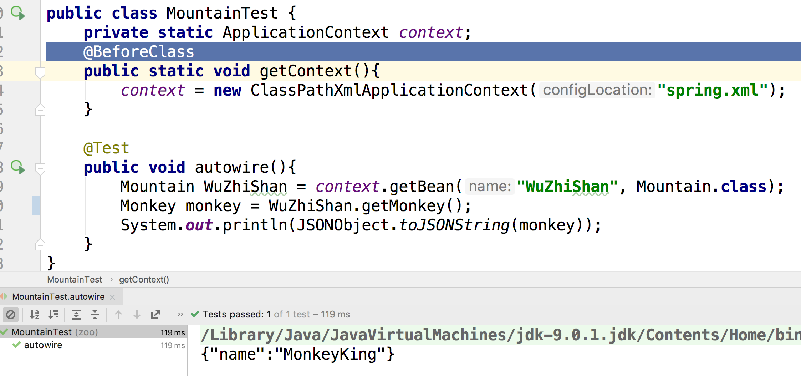
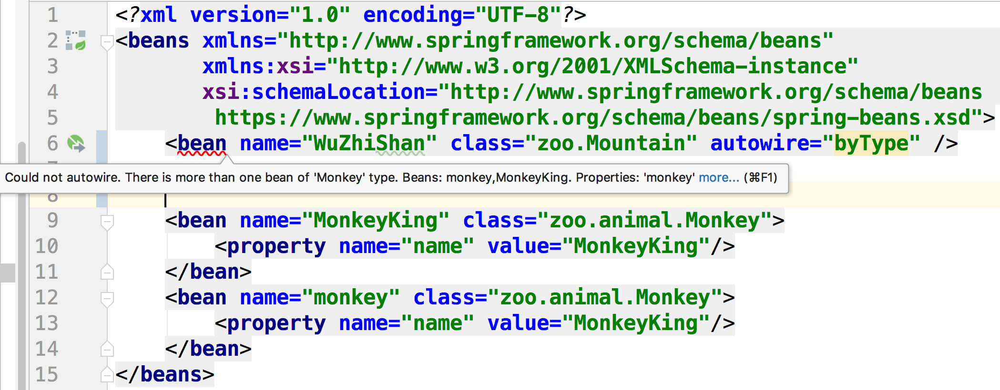
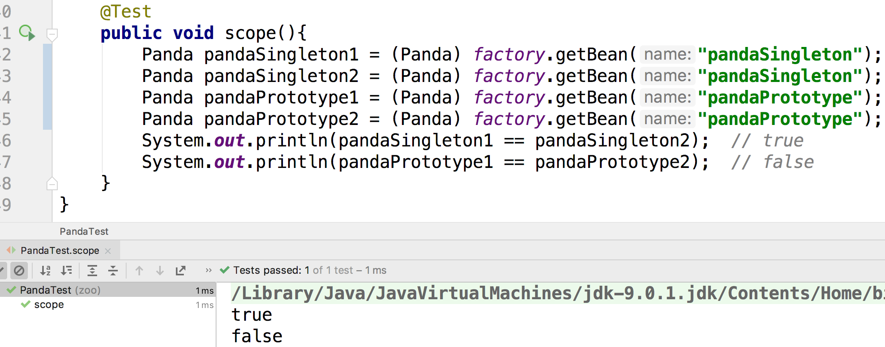
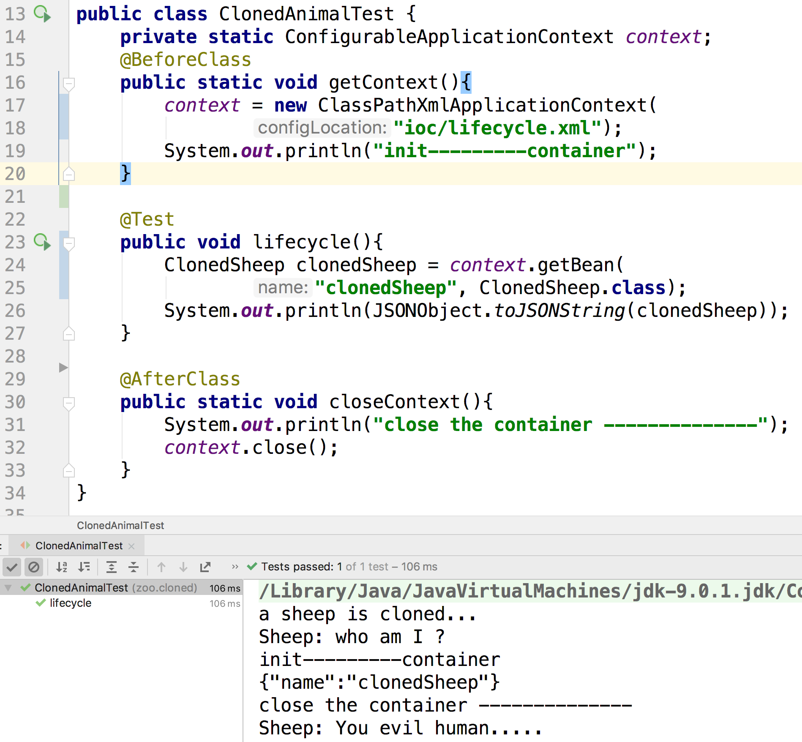
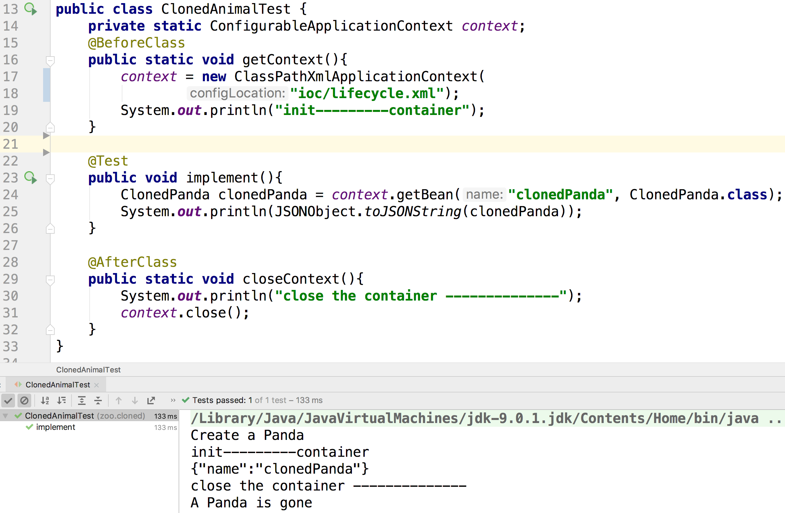

#### 如何配置一个bean？

创建一个对象也就那几个方法：

- 通过构造函数创建
- 通过无参构造函数来创建，然后通过Setter方法来赋值
- 交给工厂方法来创建

所以我们在配置bean的时候就是这三种思路，假设有这样的对象：

```java
package zoo;

import lombok.Getter;
import lombok.NoArgsConstructor;
import lombok.Setter;

@Getter @Setter
@NoArgsConstructor
public class Panda {
    private String name;
    private Float weight;
}
```

```java
package zoo;

public class Creator {
    public static Panda createChosenPanda(){
        return new Panda("DaBao", 55.5f);
    }
}
```

```java
package zoo;

public class God {
    public Panda createChosenPanda(){ 
        return new Panda("DaBao", 55.5f);
    }
}
```


我们可以这样来创建Panda，配置文件：

```xml
    <bean id="HuanHuan" class="zoo.Panda">
        <constructor-arg name="name" value="HuanHuan"/>
        <constructor-arg name="weight" type="java.lang.Float" value="22.2" />
    </bean>

    <bean id="LeLe" class="zoo.Panda">
        <property name="name" value="LeLe" />
        <property name="weight" value="33.14" />
    </bean>

    <bean id="DaBao" class="zoo.Creator" factory-method="createChosenPanda" />

    <bean id="God" class="zoo.God"/>
    <bean id="DaBao2" factory-bean="God" factory-method="createChosenPanda" />
```

第一个bean是通过构造函数传参来创建的。

第二个bean是通过无参构造函数创建后，再用Setter方法赋值。

第三个bean是通过静态工厂方法创建的。

第四个bean是通过另一个bean的实例方法来创建的。

#### 上面的配置文件中，各个属性分别有什么意义

- id：给bean起个标识符，用来在代码中引用

- class：用这个class来创建bean。

  前面两个是用`zoo.Panda`的构造函数创建bean的，后面一个是用`zoo.Creator`的静态方法创建的。

-  constructor-arg

  在创建对象时传入构造函数的参数，它有以下的属性：

  - name：匹配构造函数中的同名参数
  - value：传给构造函数对应参数的值
  - type："3.14" 究竟算是一个字符串还是一个Float类型？就靠type来划分

- property

  对象创建后通过Setter方法给对象赋的值。它的属性和constructor-arg的一样。

- factory-method： 通过`zoo.Creator`的这个方法来创建bean。

- factory-bean: 通过这个bean的方法来来创建一个新的bean。

  

#### 如何在配置中实现依赖注入？

依赖注入说白了，就是如果A对象需要依赖B对象，那么B对象不应该在A的方法中创建，而应该在其他地方创建，然后通过构造函数传参或者Setter方法交给A。

```java
package zoo;

import lombok.Getter;
import lombok.NoArgsConstructor;
import lombok.Setter;

@Getter @Setter
@NoArgsConstructor
public class PandaWatcher {
    private String name;
    private Panda panda;

    public PandaWatcher(String name, Panda panda) {
        this.name = name;
        this.panda = panda;
    }
}
```

现在我们的PandaWatcher需要一只大熊猫，我们就可以这样写配置：

```xml
    <bean id="Marry" class="zoo.PandaWatcher">
        <constructor-arg name="name" value="Marry" />
        <constructor-arg name="panda" ref="LeLe"/>
    </bean>

    <bean id="Jack" class="zoo.PandaWatcher">
        <property name="name" value="Jack"/>
        <property name="panda" ref="HuanHuan"/>
    </bean>
```


通过ref引用另一个bean就实现了依赖注入。前者是通过构造函数，后者是通过属性的Setter方法。

#### p 命名空间是干什么的？

可以通过p命名空间来简化我们的写法

```xml
<?xml version="1.0" encoding="UTF-8"?>
<beans xmlns="http://www.springframework.org/schema/beans"
       xmlns:p="http://www.springframework.org/schema/p"
       xmlns:xsi="http://www.w3.org/2001/XMLSchema-instance"
       xsi:schemaLocation="http://www.springframework.org/schema/beans
        https://www.springframework.org/schema/beans/spring-beans.xsd">
  
    <bean id="LeLe" class="zoo.Panda">
        <property name="name" value="LeLe" />
        <property name="weight" value="33.14" />
    </bean>

    <bean id="LeLe2" class="zoo.Panda" p:name="LeLe2" p:weight="33.14"/>
</beans>
```

上面两个bean语法上是一样的。通过p命名空间，可以简化我们的写法。

#### 上面演示中的bean，是在容器初始化的时候被创建，还是在我们获取bean的时候才被临时创建？

singleton的bean都是在容器初始化的时候被创建的，我们可以通过lazy-init这个属性来配置成懒加载，如下：

```xml
<bean id="lazy" class="com.something.ExpensiveToCreateBean" lazy-init="true"/>
```

是注意一个陷阱，如果上面的bean被一些non-lazy-init 的singleton的bean依赖的话，它还是会被立刻实例化，因为它被依赖了！

#### 如果bean A只被bean B使用，有没有一种方法实现作用域隔离，使得bean A 不能被其他bean ref？

我们可以配置成内部bean：

```xml
    <bean id="Jon" class="zoo.PandaWatcher">
        <property name="name" value="Jack"/>
        <property name="panda">
            <bean class="zoo.Panda">
                <property name="name" value="Jon's Panda" />
                <property name="weight" value="33.14" />
            </bean>
        </property>
    </bean>
```


我们可以创建一个内置bean来达到作用域控制。

#### 在Spring 配置中，支持集合、列表、Map这些数据结构吗？

``` java
package zoo;

import lombok.Getter;
import lombok.NoArgsConstructor;
import lombok.Setter;
import zoo.animal.Panda;

import java.util.List;
import java.util.Map;
import java.util.Set;

@Getter @Setter
@NoArgsConstructor
public class Room {
    private Set<Panda> pandaSet;
    private List<Panda> pandaList;
    private Map<String, Panda> pandaMap;
}
```

能够在配置文件中配置这三种数据结构的依赖注入？

##### 答：

这三种数据结构都支持：

```xml
    <bean id="P1" class="zoo.Panda">
        <constructor-arg name="name" value="P1" />
        <constructor-arg name="weight" type="java.lang.Float" value="22.2" />
    </bean>
    <bean id="P2" class="zoo.Panda">
        <constructor-arg name="name" value="P1" />
        <constructor-arg name="weight" type="java.lang.Float" value="22.2" />
    </bean>

    <bean name="room" class="zoo.Room">
        <property name="pandaList">
            <list>
                <ref bean="P1"/>
                <ref bean="P2"/>
            </list>
        </property>
        <property name="pandaMap">
            <map>
                <entry key="P1" value-ref="P1"/>
                <entry key="P2" value-ref="P2"/>
            </map>
        </property>
        <property name="pandaSet">
            <set>
                <ref bean="P1"/>
                <ref bean="P2"/>
            </set>
        </property>
    </bean>
```

如上面所写。

#### autowire是干什么的？

假bean A 依赖其他的bean，那么可以通过配置autowire属性，让Spring自动的帮我们注入属性，而不需要手动指明。

```java
package zoo;

import lombok.Getter;
import lombok.Setter;

@Getter @Setter
public class Mountain {
    private Monkey monkey;
}
```

```java
package zoo;

import lombok.Getter;
import lombok.Setter;

@Getter @Setter
public class Monkey {
    private String name;
}
```

```xml
    <bean name="WuZhiShan" class="zoo.Mountain" autowire="byType">
    </bean>
    <bean name="MonkeyKing" class="zoo.Monkey">
        <property name="name" value="MonkeyKing"/>
    </bean>
```

在上面的配置中，我们的五指山需要一只猴子，同时我们开启了autowire，那么Spring在运行时就会按照一定规则，帮我们自动注入。



autowire这个属性有四个可选的值

- no(默认)：不启动自动装配，如果这个bean依赖了其他bean，必须手动显式的指明

- byType：就是我们上面写的，WuZhiShan需要一个猴子，那么Spring 就会选取一个类型为猴子的bean自动注入。如果类型为猴子的bean不等于1，那么就会出现歧义，所以Spring就会抛出异常。

  

- byName：假如被设置为byName，那么Spring就会寻找名称为`monkey`的bean来完成自动注入。


#### 如果我们在代码中多次获取id为'LeLe'的bean，那么这些获得的bean是同一个对象，还是说每次尝试获取bean的时候，Spring都会创建一个新的对象？

这取决与我们的配置:

```xml
<?xml version="1.0" encoding="UTF-8"?>
<beans xmlns="http://www.springframework.org/schema/beans"
       xmlns:xsi="http://www.w3.org/2001/XMLSchema-instance"
       xsi:schemaLocation="http://www.springframework.org/schema/beans
        https://www.springframework.org/schema/beans/spring-beans.xsd">
    <bean name="pandaSingleton" class="zoo.animal.Panda" scope="singleton">
        <constructor-arg name="name" value="panda" />
        <constructor-arg name="weight" value="33.3"/>
    </bean>
    <bean name="pandaPrototype" class="zoo.animal.Panda" scope="prototype">
        <constructor-arg name="name" value="panda" />
        <constructor-arg name="weight" value="33.3"/>
    </bean>
</beans>
```

bean有个scope属性，它有下面的可选值：

- singleton(默认的)

  如果是这个属性，那么这个bean只会被实例化一次，我们每次会获得同一个对象

- prototype

  如果是这个属性，那么每次从容器中获取这个bean的时候，都会创建一个新的对象





#### 假如我们想在bean创建和销毁的时候做一点什么事情的话，我们该怎么实现？

Spring 提供了生命周期的概念，我们可以配置钩子函数，Spring会在相应的时间节点调用它们。

``` java
package zoo.animal.cloned;

import lombok.Getter;
import lombok.NoArgsConstructor;
import lombok.Setter;

@Getter @Setter
@NoArgsConstructor
public class ClonedSheep {
    private String name;

    public void createSheep(){
        System.out.println("a sheep is cloned...");
        System.out.println("Sheep: who am I ?");
    }

    public void destroySheep(){
        System.out.println("Sheep: You evil human.....");
    }
}
```

配置文件这样写：

```xml
    <bean name="clonedSheep" class="zoo.animal.cloned.ClonedSheep" p:name="clonedSheep"
          init-method="createSheep" destroy-method="destroySheep"/>
```

- init-method：

  创建bean之后调用

- destroy-method：

  销毁bean后调用



除了上面这种写法，我们还可以让bean实现一个接口，而不需要在配置文件中指定。

``` java
package zoo.animal.cloned;

import lombok.Getter;
import lombok.NoArgsConstructor;
import lombok.Setter;
import org.springframework.beans.factory.DisposableBean;
import org.springframework.beans.factory.InitializingBean;

@Getter @Setter
@NoArgsConstructor
public class ClonedPanda implements InitializingBean, DisposableBean {
    private String name;

    public void afterPropertiesSet() throws Exception {
        System.out.println("Create a Panda");
    }

    public void destroy() throws Exception {
        System.out.println("A Panda is gone");
    }
}
```

```xml
<bean name="clonedPanda" class="zoo.animal.cloned.ClonedPanda" p:name="clonedPanda"/>
```

如果Spring监测到了bean实现了这个接口，就会在对应的时机调用它。

