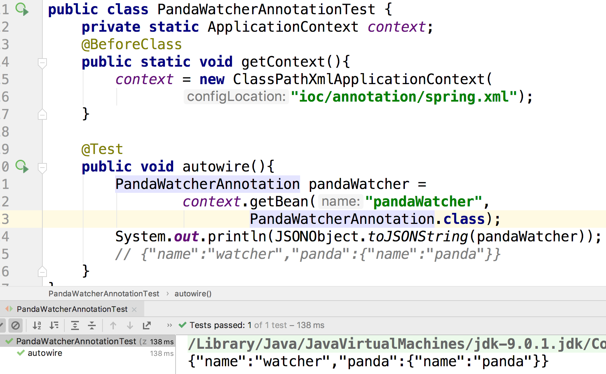

Spring 可以通过注解来代替配置文件的写法。如果想使用注解的话，需要在配置文件中开启注解模式。

```xml
<?xml version="1.0" encoding="UTF-8"?>
<beans xmlns="http://www.springframework.org/schema/beans"
       xmlns:p="http://www.springframework.org/schema/p"
       xmlns:xsi="http://www.w3.org/2001/XMLSchema-instance"
       xmlns:context="http://www.springframework.org/schema/context"
       xsi:schemaLocation="http://www.springframework.org/schema/beans
        https://www.springframework.org/schema/beans/spring-beans.xsd
        http://www.springframework.org/schema/context
        https://www.springframework.org/schema/context/spring-context.xsd">

    <context:annotation-config/>

    <bean name="..." class="..." p:name="..."/>
    <bean name="..." class="....">
        <property name="...." value="..."/>
    </bean>
</beans>
```

注意`<context:annotation-config/>`

#### 使用@Autowire来实现自动装配

```java
package zoo.annotation;

@Getter @Setter
@NoArgsConstructor
public class PandaWatcherAnnotation {
    private String name;

    @Autowired
    private Panda panda;
}

```

我们的熊猫守望者需要一只熊猫

``` xml
    <bean name="panda" class="zoo.animal.Panda" p:name="panda"/>
    <bean name="pandaWatcher" class="zoo.annotation.PandaWatcherAnnotation">
        <property name="name" value="watcher"/>
    </bean>
```

我们没有给pandaWatcher传递panda属性，但是Spring在创建bean pandaWatcher时，如果发现@Autowire这个注解，那么它就会自动注入一个熊猫。



这个标注也可以放在构造函数上

``` java
@Getter @Setter
@NoArgsConstructor
public class PandaWatcherConstructorAnnotation {
    private String name;
    private Panda panda;

    @Autowired
    public PandaWatcherConstructorAnnotation(Panda panda){
    }
}
```

```xml
    <bean name="pandaWatcherConstructor"
          class="zoo.annotation.PandaWatcherConstructorAnnotation">
        <property name="name" value="watcher"/>
    </bean>
```

然后配置文件也不用写额外的东西。


当然，也放到Setter方法上

```java
@NoArgsConstructor
public class PandaWatcherSetterAnnotation {
    private String name;
    private Panda panda;

    public String getName() {
        return name;
    }
    public void setName(String name) {
        this.name = name;
    }
    public Panda getPanda() {
        return panda;
    }
    @Autowired
    public void setPanda(Panda panda) {
        this.panda = panda;
    }
}
```

```xml
    <bean name="pandaWatcherSetter"
          class="zoo.annotation.PandaWatcherSetterAnnotation">
        <property name="name" value="watcher"/>
    </bean>
```

#### @Autowire 是基于byType 还是 byName装配的？

